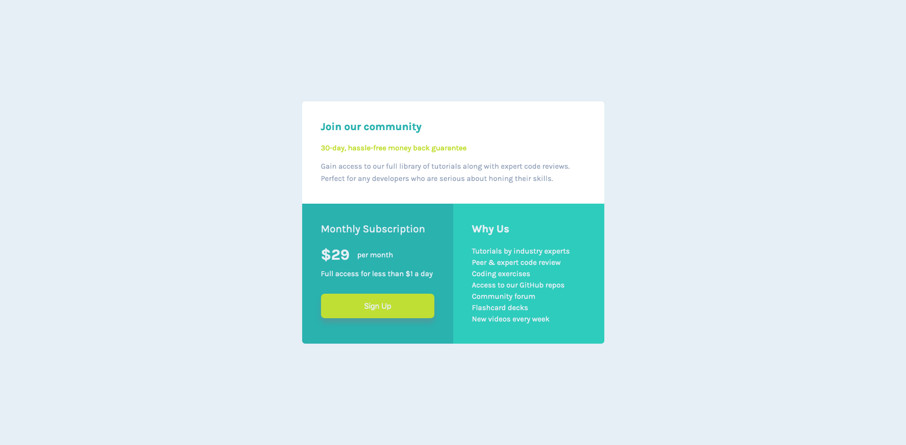
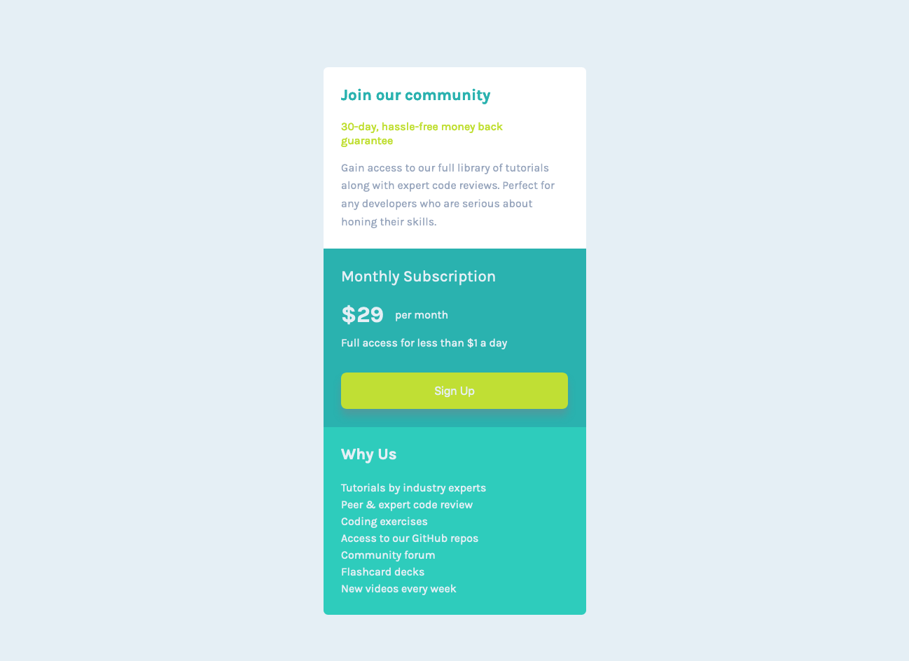

<h1> Frontend Mentor - Single price grid component solution </h1>

This is a solution to the [Single price grid component challenge on Frontend Mentor](https://www.frontendmentor.io/challenges/single-price-grid-component-5ce41129d0ff452fec5abbbc). Frontend Mentor challenges help you improve your coding skills by building realistic projects.

 

## <b>Table of contents</b>

- [Screenshots](#screenshots)
- [Links](#links)
- [Built with](#built-with)
- [Mentions](#mentions)
- [My social profiles](#profiles)

 

---

 

## Screenshots

 

Desktop

Mobile

 

---

 

## Links

👉 Solution Frontend Mentor: [Frontend solution]()

👉 Live Site: [Live site with GitHub Pages]()

 

---

 

## Built with

 

  - BEM

  - CSS custom properties
  - Flexbox
  - Grid

 

----

 

## Mentions

I have used and modified Eduardo Fierro's reset, here is his github profile.  
[Eduardo's github profile](https://github.com/eduardofierropro/Reset-CSS)

 

---

 

<b><h2 id="profiles" align="center" style="">My social profiles</h2></b>

